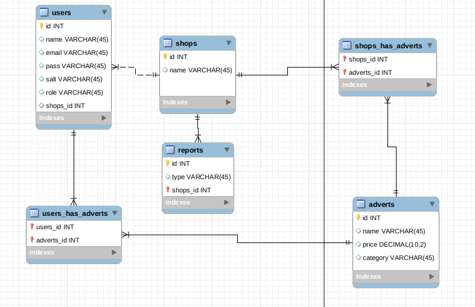

## **E-Commerce Faculdade Toledo**


 - Luís Augusto C. Mota (2022) - ADS
### **About the Project**
Projeto desenvolvido para a matéria Frameworks para Desenvolvimento de Software para o Curso de ADS da Faculdade Toledo de Presidente Prudente

<p align="center">
    
</p>

<hr/>

### **First of All**:

- **1º Clone the Github Repository**
``` bash
    test@test~: git clone git@github.com:zScrolLock/ecommerce-toledo.py.git
    test@test~: cd ecommerce-toledo.py/
```

- **2º Copy .env.example to .env**
``` bash
    test@test~: cp .env.example .env
```
<hr/>

### **How to Run the Project**

> To Easily run it: 

```bash
    test@test~: cd app/
    test@test~: echo "alias ecommerce-toledo='source ../myenv/bin/activate && export FLASK_APP=main.py && flask run --reload --debugger'" >> $HOME/.bash_aliases
    test@test~: ecommerce-toledo
```
> zsh Case to Easily run it:

```bash
    test@test~: cd app/
    test@test~: source ~/.zshrc
    test@test~: echo "alias ecommerce-toledo='source ../myenv/bin/activate && export FLASK_APP=main.py && flask run --reload --debugger'" >> ~/.zshrc
    test@test~: ecommerce-toledo
```

> Common Method to run it:

```bash
    test@test~: cd app/
    test@test~: export FLASK_APP=main.py
    test@test~: source ../myenv/bin/active
    (myenv) test@test~: flask run --reload
```

<hr/>

### **Error Codes Explain**:

| Code | Explain  |
|---|---|
|  404 | Not found  |
|  401 | Unauthorized  |

<hr />